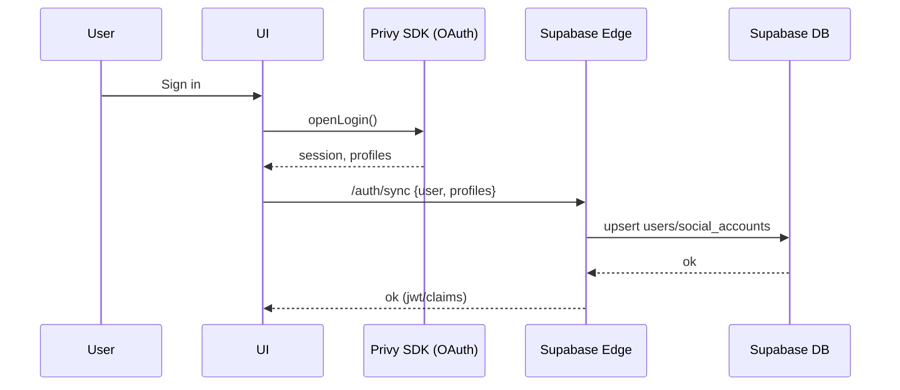
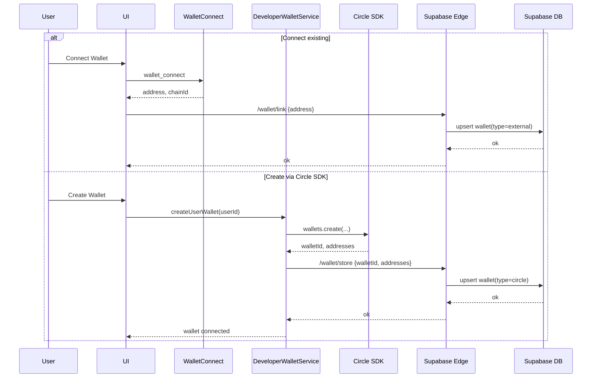
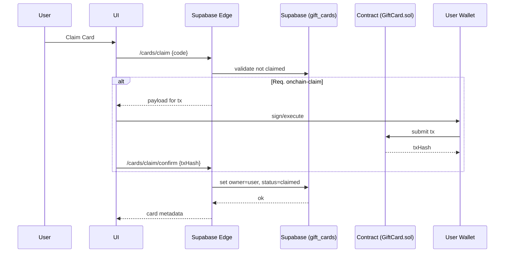
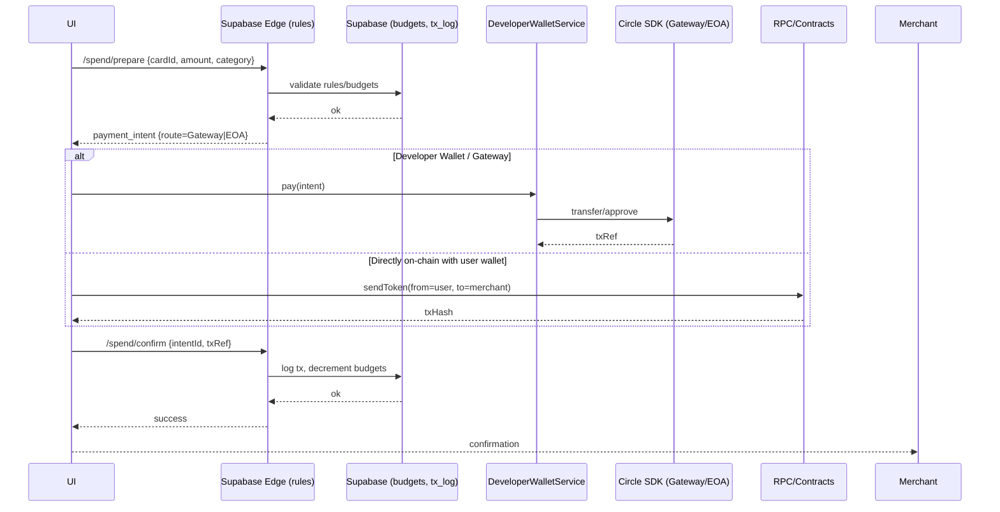

# Architecture of the main scenarios

## Socials log in

```mermaid
sequenceDiagram
    participant User
    participant UI as UI
    participant Privy as Privy SDK (OAuth)
    participant Edge as Supabase Edge
    participant DB as Supabase DB

    User->>UI: Sign in
    UI->>Privy: openLogin()
    Privy-->>UI: session, profiles
    UI->>Edge: /auth/sync {user, profiles}
    Edge->>DB: upsert users/social_accounts
    DB-->>Edge: ok
    Edge-->>UI: ok (jwt/claims)
```

## Wallet authorization: external or create via the Circle SDK

```mermaid
sequenceDiagram
    participant User
    participant UI as UI
    participant RPC as WalletConnect
    participant DW as DeveloperWalletService
    participant Circle as Circle SDK
    participant Edge as Supabase Edge
    participant DB as Supabase DB

    alt Connect existing 
        User->>UI: Connect Wallet
        UI->>RPC: wallet_connect
        RPC-->>UI: address, chainId
        UI->>Edge: /wallet/link {address}
        Edge->>DB: upsert wallet(type=external)
        DB-->>Edge: ok
        Edge-->>UI: ok
    else Create via Circle SDK
        User->>UI: Create Wallet
        UI->>DW: createUserWallet(userId)
        DW->>Circle: wallets.create(...)
        Circle-->>DW: walletId, addresses
        DW->>Edge: /wallet/store {walletId, addresses}
        Edge->>DB: upsert wallet(type=circle)
        DB-->>Edge: ok
        Edge-->>DW: ok
        DW-->>UI: wallet connected
    end
```

## Claim card

```mermaid
sequenceDiagram
    participant User
    participant UI as UI
    participant Edge as Supabase Edge
    participant DB as Supabase (gift_cards)
    participant Chain as Contract (GiftCard.sol)
    participant Wallet as User Wallet

    User->>UI: Claim Card
    UI->>Edge: /cards/claim {code}
    Edge->>DB: validate not claimed
    alt Req. onchain-claim
        Edge-->>UI: payload for tx
        UI->>Wallet: sign/execute
        Wallet->>Chain: submit tx
        Chain-->>Wallet: txHash
        UI->>Edge: /cards/claim/confirm {txHash}
    end
    Edge->>DB: set owner=user, status=claimed
    DB-->>Edge: ok
    Edge-->>UI: card metadata
```

## Spend card

```mermaid
sequenceDiagram
    participant UI as UI
    participant Edge as Supabase Edge (rules)
    participant DB as Supabase (budgets, tx_log)
    participant DW as DeveloperWalletService
    participant Circle as Circle SDK (Gateway/EOA)
    participant Chain as RPC/Contracts

    UI->>Edge: /spend/prepare {cardId, amount, category}
    Edge->>DB: validate rules/budgets
    DB-->>Edge: ok
    Edge-->>UI: payment_intent {route=Gateway|EOA}
    alt Developer Wallet / Gateway
        UI->>DW: pay(intent)
        DW->>Circle: transfer/approve
        Circle-->>DW: txRef
    else Directly on-chain with user wallet
        UI->>Chain: sendToken(from=user, to=merchant)
        Chain-->>UI: txHash
    end
    UI->>Edge: /spend/confirm {intentId, txRef}
    Edge->>DB: log tx, decrement budgets
    DB-->>Edge: ok
    Edge-->>UI: success
    UI-->>Merchant: confirmation 
```
